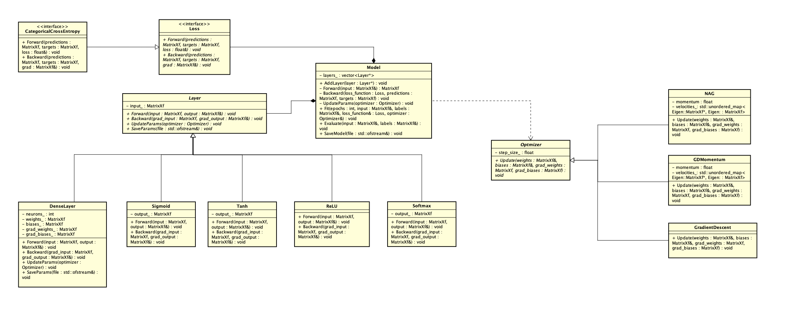

<div align="center">
  
  
  
  
  
  <br>
  
  <h1>🧠 Turing: Deep Learning Framework</h1>
  <p><em>Um motor de Redes Neurais Artificiais modular e de alto desempenho, construído do zero em C++.</em></p>
</div>

<hr>

## 📖 Visão Geral

O **Turing** é um framework educacional e de pesquisa para *Deep Learning*, implementado inteiramente em C++ moderno (C++20). Seu design prioriza a transparência matemática e arquitetural, abstraindo a complexidade através da poderosa biblioteca de álgebra linear **Eigen**.

Este repositório atua como o alicerce prático e a implementação oficial para o livro ***Inteligência Artificial: Fundamentos Teóricos, Técnicas de Aprendizado de Máquina Clássico e Aprendizado Profundo***. O projeto demonstra, passo a passo, a matemática sob o capô (como a derivação analítica de funções de perda e algoritmos de otimização no *Backward Pass*) sem depender de caixas pretas de frameworks comerciais.

## ✨ Recursos Implementados

O framework foi desenhado para ser extensível, tratando o fluxo de dados como um *pipeline* modular. As seguintes funcionalidades já estão nativamente suportadas:

* **Camadas (Layers):** `DenseLayer` (Fully Connected).
* **Funções de Ativação:** `ReLU`, `Sigmoid`, `Tanh`, `Softmax`.
* **Otimizadores:** * `GradientDescent` (SGD Padrão)
  * `GDMomentum` (Momento Clássico / Inércia)
  * `NAG` (Nesterov Accelerated Gradient)
* **Funções de Perda (Loss):** `CategoricalCrossEntropy`.
* **Métricas:** `Accuracy` (Acurácia de Classificação).
* **Utilitários:** Carregador nativo para o Dataset MNIST (`MNISTLoader.h`).

## 📐 Arquitetura

O sistema é fortemente orientado a interfaces, permitindo a fácil inclusão de novas camadas e otimizadores. O diagrama abaixo (gerado via Doxygen/Sphinx) ilustra a topologia orientada a objetos do projeto:

<div align="center">
  
</div>

## 🚀 Instalação e Compilação

O projeto utiliza o **CMake** como sistema de build. A biblioteca matemática `Eigen 3.4.0` é gerenciada e baixada automaticamente via `FetchContent` do CMake, eliminando a necessidade de instalação manual.

### Pré-requisitos
* Compilador com suporte a **C++20** (GCC, Clang ou MSVC).
* **CMake** (versão 3.10 ou superior).
* *(Apenas macOS)*: O CMakeLists está configurado para lincar o *Accelerate Framework* para otimização BLAS/LAPACK.

### Passos de Compilação

1. **Clone o repositório:**
   ```bash
   git clone [https://github.com/luizfaria1989/turing.git](https://github.com/luizfaria1989/turing.git)
   cd turing
   ```
2. **Crie o diretório de build e compile:**
   ```bash
    mkdir build && cd build
    cmake ..
    make -j4
   ```

## 🚀 Como Utilizar a API C++

A API do Turing foi desenhada para ser limpa e inspirada nos principais frameworks do mercado (como Keras/PyTorch), utilizando o paradigma orientado a objetos.

O exemplo abaixo demonstra como instanciar o orquestrador Model, empilhar camadas, configurar o motor e realizar o treinamento no dataset MNIST.

```cpp
  #include "model/Model.h"
  #include "layers/DenseLayer.h"
  #include "layers/ReLU.h"
  #include "layers/Softmax.h"
  #include "loss/CategoricalCrossEntropy.h"
  #include "optimizers/NAG.h"
  #include "MNISTLoader.h"
  
  int main() {
      // 1. Carregamento e Pré-processamento dos Dados
      Eigen::MatrixXf X_train = MNISTLoader::loadImages("data/train-images-idx3-ubyte");
      Eigen::MatrixXf Y_train = MNISTLoader::loadLabels("data/train-labels-idx1-ubyte");
  
      // 2. Construção da Arquitetura (Topologia da Rede)
      Model model;
      
      // Camada Oculta: 784 entradas (pixels 28x28) -> 128 neurônios com ativação ReLU
      model.AddLayer(new DenseLayer(784, 128));
      model.AddLayer(new ReLU());
  
      // Camada de Saída: 128 -> 10 neurônios (classes 0-9) com ativação Softmax
      model.AddLayer(new DenseLayer(128, 10));
      model.AddLayer(new Softmax());
  
      // 3. Configuração do Motor de Treinamento
      CategoricalCrossEntropy loss_function;
      NAG optimizer(0.01f, 0.01f); // Nesterov Accelerated Gradient com Taxa de Aprendizado e Momento
  
      // 4. Loop de Treinamento (Fit)
      int epochs = 20;
      int batch_size = 64;
      
      // A mágica do Backpropagation acontece aqui
      model.Fit(epochs, batch_size, X_train, Y_train, loss_function, optimizer);
  
      // 5. Inferência (Opcional)
      // model.Evaluate(X_test, Y_test);
      
      return 0;
  }
```

## 📂 Estrutura de Diretórios

```bash
turing/
├── CMakeLists.txt              # Configuração do build system (inclui dependência do Eigen)
├── main.cpp                    # Ponto de entrada e exemplo de uso prático
├── MNISTLoader.h               # Parser binário e normalizador para dados MNIST
├── model/                      # Orquestrador sequencial da rede (Forward/Backward loops)
├── layers/                     # Implementações de Camadas e Ativações (Polimorfismo)
├── loss/                       # Funções Custo/Perda
├── optimizers/                 # Algoritmos de descida de gradiente (SGD, Momentum, NAG)
├── metrics/                    # Funções de avaliação (Acurácia, etc.)
└── docs/                       # Documentação (Sphinx + Doxygen) e Diagramas UML
```

